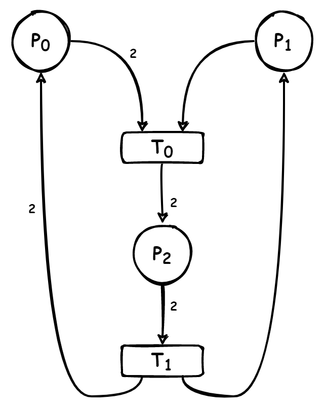
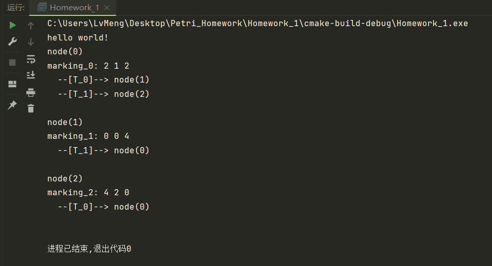
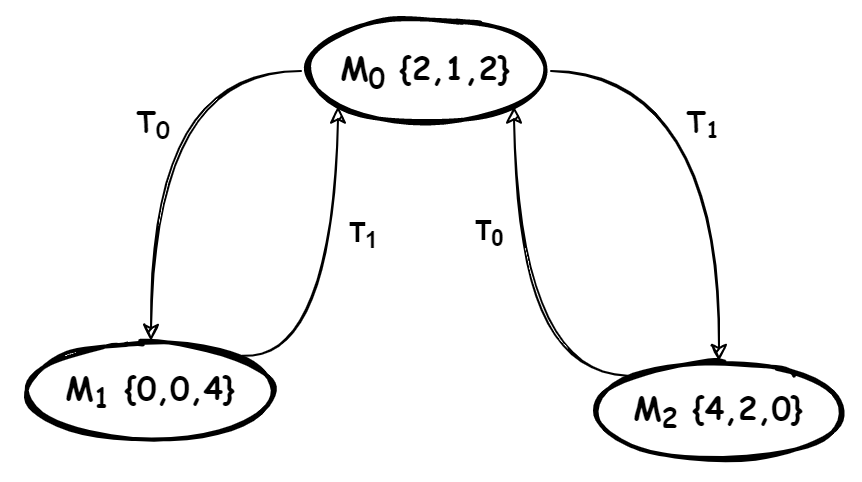
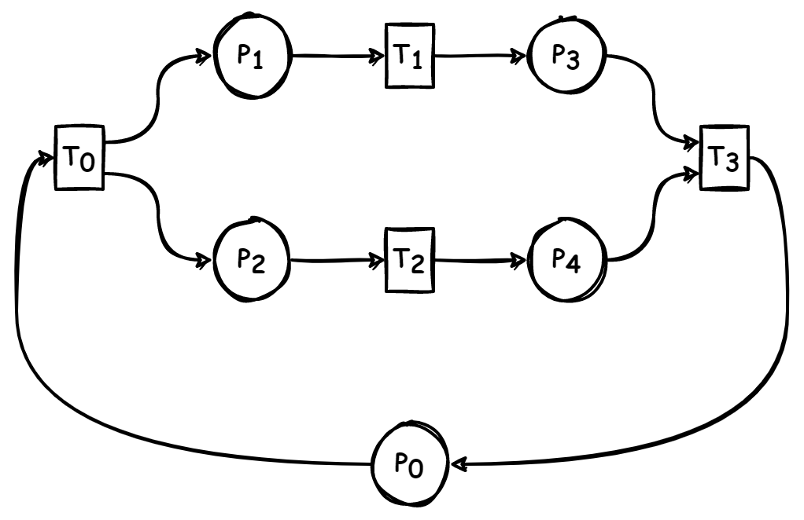
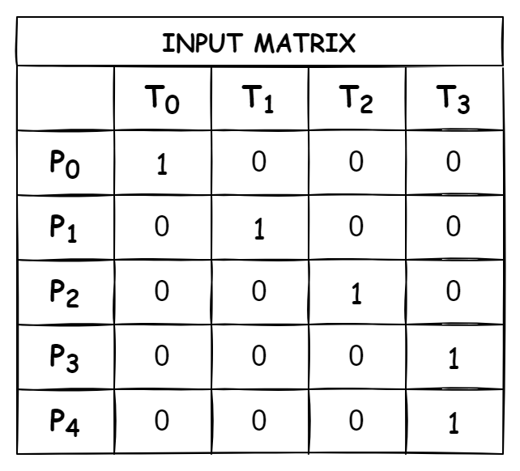
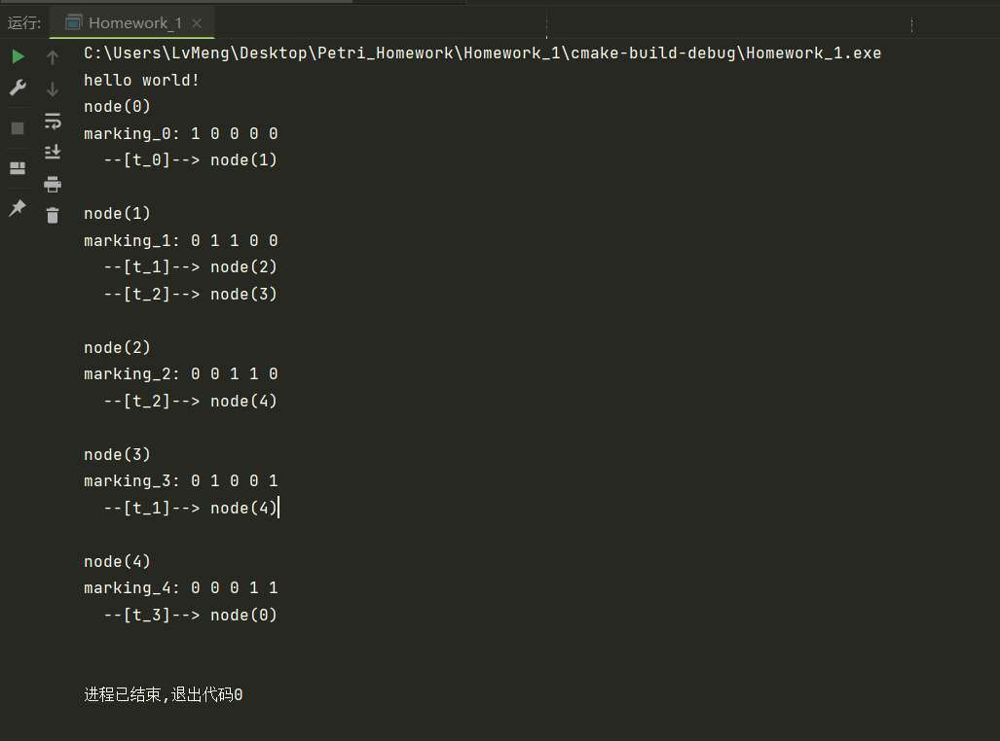
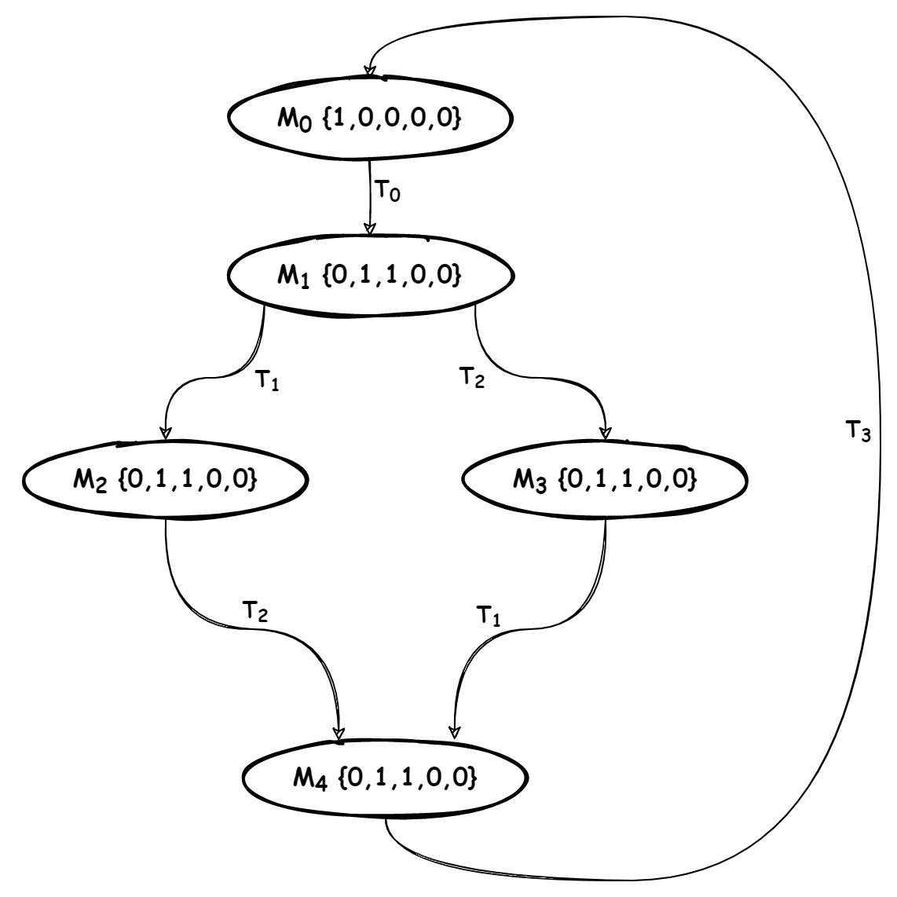

[toc]

# 代码

## 源代码结构

* main.cpp
* petri_net.h
* petri_net.cpp
* reachability_graph.h
* reachability_graph.cpp
## petri net类

```CPP
class PetriNet {
private:
  //PN={P,T,I,O,Mi}
  Eigen::VectorXi place_; // 库所
  Eigen::VectorXi transition_;// 变迁
  unsigned int num_of_place_ = 0;
  unsigned int num_of_trans_ = 0;
  Eigen::SparseMatrix<int> input_matrix_;// 前置矩阵
  Eigen::SparseMatrix<int> output_matrix_;//后置矩阵
  Eigen::SparseMatrix<int> trans_matrix_;
  std::vector<int> firable_transition_;//可激发的变迁保存到成员变量中
  Eigen::VectorXi marking_;// 状态标识
  static PetriNet *instance_;  //单例对象指针

  // 构造和析构成为私有的, 禁止外部构造和析构
  PetriNet(Eigen::VectorXi &p, Eigen::VectorXi &t,
           Eigen::MatrixXi &i, Eigen::MatrixXi &o,
           Eigen::VectorXi &m_0);
  PetriNet() = default;
  ~PetriNet() = default;
  // 更新可用激发
  void FreshFirableTransition();
public:
  // 禁止外部拷贝和赋值
  PetriNet(const PetriNet &) = delete;
  const PetriNet &operator=(const PetriNet &) = delete;
  // 实例化创建。获得本类实例的唯一全局访问点
  static PetriNet *GetInstance(Eigen::VectorXi &p, Eigen::VectorXi &t,
                               Eigen::MatrixXi &i, Eigen::MatrixXi &o,
                               Eigen::VectorXi &m_0);
  // 获取当前petri_net的Marking
  const Eigen::VectorXi &GetMarking() const;
  // 设置marking
  void SetMarking(const Eigen::VectorXi &marking);
  // 获取可用的激发
  const std::vector<int> &GetFirableTransition() const;
  // 激发一个transition，并改变petri net的状态
  void FiringATransition(int t);
};
#endif //PETRI_NET_H
```

## MarkingNode类

```CPP
class MarkingNode {
public:
  int node_name_ = -1;// 状态节点的编号（Name）
  Eigen::VectorXi marking_;// 本节点状态, Mi = {P1,P2,P3...}
  std::vector<std::pair<int, int>> transition_to_son_;// pair<which_transition, son_node>
  MarkingNode(int node_name, Eigen::VectorXi marking);
  MarkingNode() = default;
};
```

## Reachability Graph类

```CPP
class ReachabilityGraph {
private:
  // 标识当前共有多少个状态
  int marking_number_ = 0;
  // 维护v_new_，保存已出现但未激发的状态，因为v_new_需遍历/增删首尾元素，用vector较合理
  std::vector<Eigen::VectorXi> v_new_;
  // 维护v_old_，反向检索某状态是否已出现过，因v_old_只需添加/检索无需遍历，用unordered_map/set更快
  std::unordered_map<std::string, std::pair<bool,int>> v_old_;
  // 维护nodes_结构体数组表示可达图
  std::vector<MarkingNode> nodes_;
  bool AddNode(const int &node_name,
               const Eigen::VectorXi &marking,
               const std::vector<std::pair<int, int>> &transition_to_son);
  bool AddNode(const int &node_name,
               const Eigen::VectorXi &marking);
  static std::string Vector2String(Eigen::VectorXi Eigen_vector_int);
  int GetNodeNumberInVOld(const Eigen::VectorXi &mark) const;
  bool GetNodeStatusInVOld(const Eigen::VectorXi &mark) const;
  bool SetNodeFiredInVOld(const Eigen::VectorXi &mark);
public:
  bool BuildReachabilityGraph(PetriNet *petri_net);
  // 外部调用GetNodes()获取成员变量nodes_即可以描述可达图
  const std::vector<MarkingNode> &GetNodes() const;
};
```

# 例子

## 例一：H2O


<div align="left">
   
</div>



## 例二：自定义的简单网络


<div align="left">
   
</div>




