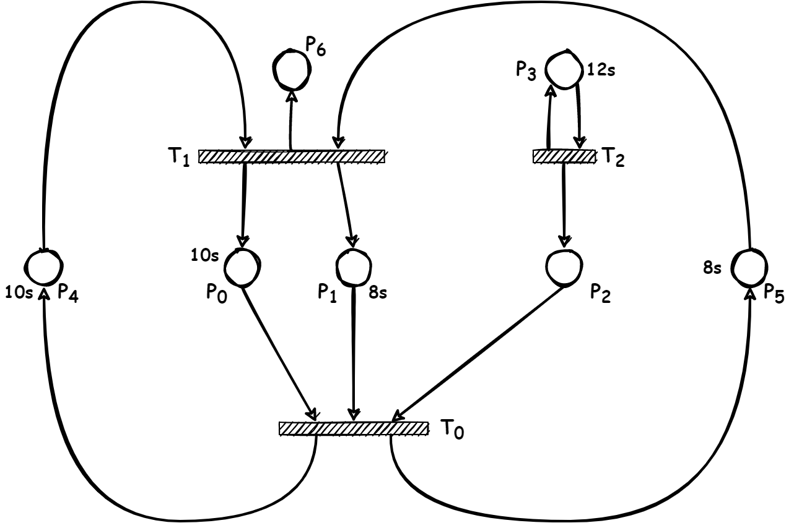
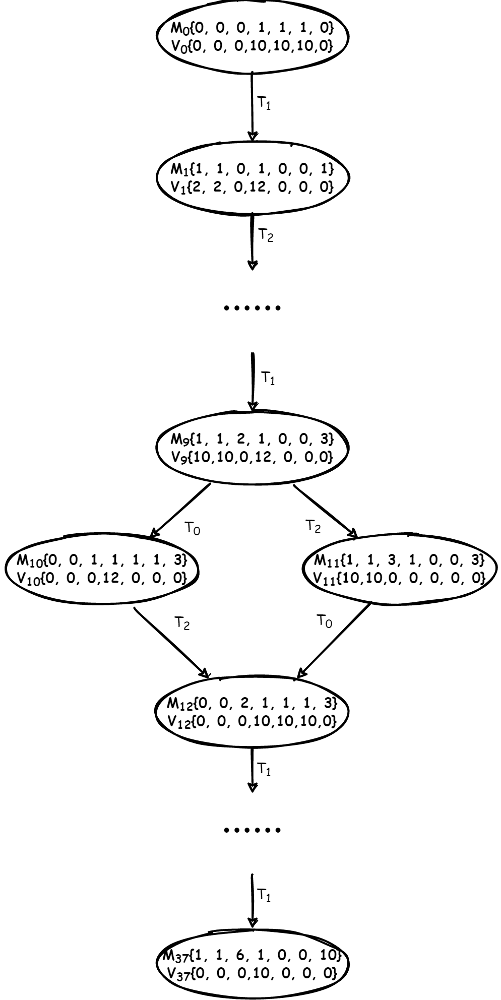

[toc]

# 附时Petri网

* 派生类PlaceTimedPetriNet - 继承

# 代码

## 源代码结构

* main.cpp
* petri_net.h
* petri_net.cpp
* timed_reachability_graph.h
* timed_reachability_graph.cpp
## PetriNet类

```CPP
class PetriNet {
protected:
  Eigen::VectorXi place_; // 库所
  Eigen::VectorXi transition_;// 变迁
  unsigned int num_of_place_ = 0;// 库所数
  unsigned int num_of_trans_ = 0;// 变迁数
  Eigen::SparseMatrix<int> input_matrix_;// 前置矩阵
  Eigen::SparseMatrix<int> output_matrix_;//后置矩阵
  Eigen::SparseMatrix<int> trans_matrix_;
  std::vector<int> firable_transition_;//可激发的变迁
  Eigen::VectorXi marking_;// 状态标识
private:
  bool FreshFirableTransition();
public:
  PetriNet() = default;
  ~PetriNet() = default;
  PetriNet(Eigen::VectorXi &p, Eigen::VectorXi &t,
           Eigen::MatrixXi &i, Eigen::MatrixXi &o,
           Eigen::VectorXi &m_0) {
      place_ = p;
      transition_ = t;
      num_of_place_ = static_cast<int>(p.size());
      num_of_trans_ = static_cast<int>(t.size());
      // 采用稀疏矩阵来表示input、output、trans，优点：节省存储空间
      input_matrix_ = i.sparseView();
      output_matrix_ = o.sparseView();
      trans_matrix_ = (o - i).sparseView();
      // 初始状态就是m0
      marking_ = m_0;
      FreshFirableTransition();
  }
  const Eigen::VectorXi &GetMarking() const;
  void SetMarking(const Eigen::VectorXi &marking);
  const std::vector<int> &GetFirableTransition() const;
  bool FiringATransition(int t);
};
```

## TimedPetriNet类
```CPP
class PlaceTimedPetriNet : public PetriNet {
private:
  int time_origin_;// 时间起点
  int time_stamp_;// 时间戳--g
  std::pair<int, int> next_firable_information_;// 下一个变迁准备就绪还需要等待的 <时间, trans> --\lambda
  Eigen::VectorXi place_delay_;// 库所需要时延（客观配置）--d
  Eigen::VectorXi token_wait_time_;// 等待时间--v, 更新时间戳后需要修改等待时间
  Eigen::VectorXi token_entry_time_;// token入库时间, 激发后需要修改入库时间
  std::vector<int> untimed_firable_transition_;// 在未来可能激发的变迁

  void SetTimeStamp(int time_stamp);
  bool UntimedFreshFirableTransition();
  bool CalcNextFirableInformation();
  bool FreshFirableTransition();
  bool FreshTokenWaitTime();
  bool FreshPlaceTimedPetriNet();
public:
  PlaceTimedPetriNet(Eigen::VectorXi &p,
                     Eigen::VectorXi &t,
                     Eigen::MatrixXi &i,
                     Eigen::MatrixXi &o,
                     Eigen::VectorXi &m_0,
                     Eigen::VectorXi &place_delay) : PetriNet(p, t, i, o, m_0),
                                                     place_delay_(place_delay),
                                                     time_origin_(0),
                                                     time_stamp_(0) {
      token_entry_time_ = Eigen::VectorXi::Zero(num_of_place_);
      token_wait_time_ = Eigen::VectorXi::Zero(num_of_place_);
      FreshPlaceTimedPetriNet();
  }
  int GetTimeStamp() const;
  bool FastForward(int add_time);
  const Eigen::VectorXi &GetTokenWaitTime() const;
  void SetTokenWaitTime(const Eigen::VectorXi &token_wait_time);
  const Eigen::VectorXi &GetTokenEntryTime() const;
  void SetTokenEntryTime(const Eigen::VectorXi &token_entry_time);
  bool FiringATransition(int t, int add_time_stamp);
  const std::pair<int, int> &GetNextFirableInformation() const;
  bool ResetTimedPetriNet(const TimedPetriNetInfo &timed_petri_net_info);
};
```

## Reachability Graph类

```CPP
class ReachabilityGraph {
private:
  // 维护nodes_结构体数组表示可达图
  std::vector<MarkingNode> nodes_;
protected:
  // 用于标识当前共有多少个状态
  int marking_number_ = 0;
  // 维护v_new_，保存已出现但未激发的状态，因为v_new_需遍历/增删首尾元素，用vector较合理
  std::vector<TimedPetriNetInfo> v_new_;
  // 维护v_old_，反向检索某状态是否已出现过，因v_old_只需添加/检索无需遍历，用unordered_map更快
  std::unordered_map<std::string, std::pair<bool, int>> v_old_;// pair<是否已激发过，此状态分配的编号>
  bool AddNode(const int &node_name,
               const TimedPetriNetInfo &timed_petri_net_info,
               const std::vector<std::pair<int, int>> &transition_to_son);
  bool AddNode(const int &node_name,
               const TimedPetriNetInfo &timed_petri_net_info);
  bool ChangeNodeInfo(const int &node_name, const TimedPetriNetInfo &new_info);
  // 因为不想写hash函数，所以多绕一步将vector转化为string
  static std::string Vector2String(Eigen::VectorXi Eigen_vector_int);
  static std::string GetStringFromNetInfo(const PlaceTimedPetriNet *timed_petri_net);
  static std::string GetStringFromNetInfo(const TimedPetriNetInfo &timed_petri_net_info);
  int GetNodeNumberInVOld(const std::string &info_str) const;
  bool GetNodeStatusInVOld(const std::string &info_str) const;
  bool SetNodeFiredInVOld(const std::string &info_str);
public:
  bool BuildReachabilityGraph(PlaceTimedPetriNet *timed_petri_net, Eigen::VectorXi goal_making);
  const std::vector<MarkingNode> &GetNodes() const;
};
```
# 图

## 模型



## 可达图

