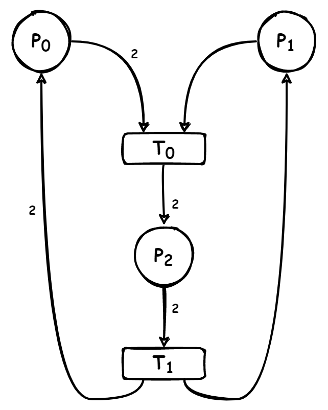
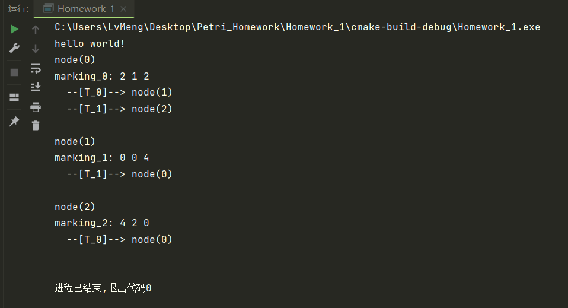
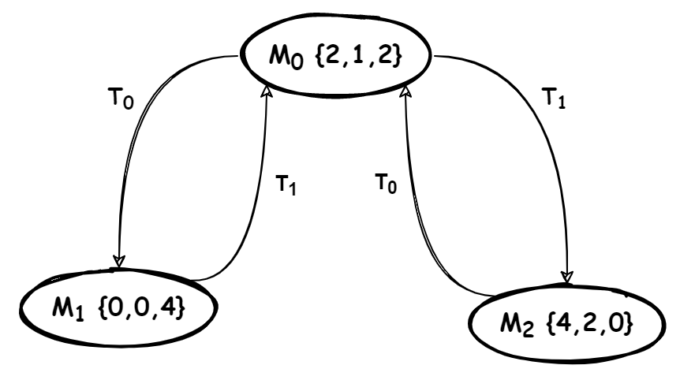

[toc]

# 1  离散事件动态系统

&emsp;&emsp;离散事件动态系统 (<b>*Discrete Event Dynamic Systems, DEDS*</b>) 是一种研究离散事件 (*Discrete Events*) 和系统响应 (*System Response*) 之间关系的理论和方法。离散事件动态系统是由异步、突发的事件驱动状态演化的，每个事件都会导致系统状态的变化。事件可以是外部事件，如来自传感器的信号，也可以是内部事件，如系统内部定时器的触发。与传统的物理系统不同，这类系统中均存在着大量的离散事件过程,其运行规律难以用物理定律加以描述，而是服从于一些人为的规则。系统普遍投资巨大，运行费用昂贵，如何提高系统的利用率和运行效率是决策者、设计者与使用者普遍关注的研究课题，迫切需要在理论方面进行深入的研究。离散事件动态系统在许多领域中都有广泛的应用，如生产过程控制、计算机网络、电信系统、自动化控制等。
&emsp;&emsp;在 *DEDS* 的研究中，常把 *DEDS* 的模型和分析区分为逻辑层次、代数层次和统计性能层次三个基本层次。*DEDS* 模型和分析的逻辑层次，着眼于在逻辑时间层次上来研究 *DEDS* 中时间和状态的符号序列关系，采用的主要数学工具包括形式语言/有限自动机、佩特利网（<b>*Petri net*</b>）、马尔科夫链（*Markov Chain*）等。本文主要介绍关于 *Petri* 网对离散事件动态系统的建模方法和仿真举例。

# 2 *Petri* 网

&emsp;&emsp;*Petri* 网是分布式系统的建模和分析工具。它特别便于描述系统中进程或部件的顺序、并发、冲突以及同步等关系。同其他系统网模型相比较，对真并发的恰切描述是 *Petri* 网的独特优势。
&emsp;&emsp;*Petri* 网的概念是1962年由德国科学家*Carl Adam Petri*在他的博士论文“*Kommunikation mit Automaten*”(用自动机通信）中首先提出来的。为了使并发这一概念直观化，论文中提出了一种用于描述物理进程和物理系统的组合的网状模型。由此发展起来的一类系统模型，后来被人们称之为 *Petri* 网。20世纪70年代初，*Petri* 网的概念和思想方法受到欧美学者的广泛关注。对 *Petri* 网的各种性质的研究，以及把 *Petri* 网应用于各种实际系统的建模和性质分析的论文和研究报告开始大量涌现。
&emsp;&emsp;作为一种系统模型，*Petri* 网不仅可以刻画系统的结构，而且可以描述系统的动态行为(如系统的状态变化等)。*Petri* 网既有直观的图形表示，又可以引入许多数学方法对其性质进行分析。对于复杂的系统，*Petri* 网可以对其进行分层描述，逐步求精，便于同面向对象的思想方法相沟通。经过40多年的发展，不仅 *Petri* 网理论本身已形成一门系统的、独立的学科分支，而且 *Petri* 网在计算机科学技术（如操作系统、并行编译、网络协议、软件工程、形式语义、人工智能等)，自动化科学技术（如离散事件动态系统、混杂系统等)，机械设计与制造（如柔性制造系统)，以及其他许多科学技术领域，都得到广泛的应用。*Petri* 网理论的发展必将为信息论奠定坚实的理论基础。

## 2.1 *Petri* 网的基本概念

&emsp;&emsp;*Petri* 网是一种网状信息流模型，包括条件和事件两类结点，在条件和事件为结点的有向二分图基础上添加表示状态信息的托肯（ *token* )分布，并按引发规则使得事件驱动状态演变，从而反映系统动态运行过程。通常情况下，用小矩形表示事件（称作变迁）结点，用小圆形表示条件（称作库所）结点，变迁结点之间、库所结点之间不能有有向弧，变迁结点与库所结点之间连接有向弧，由此构成的有向二分图称作网（*net*）。网的某些位置结点中标上若干黑点（ *token* )，从而构成 *Petri* 网。

### 2.1.1 *Petri* 网的表示

经典$Petri$网的模型用一个五元组表示：$N=(P,T,C^-,C^+,m_0)$，其中：

$P={p_1,p_2,...,p_n}$  表示有限且非空的库所（*Place*）的集合；

$T={t_1,t_2,...,t_n} $ 表示有限且非空的变迁（*Transition*）的集合；

$C^-=P \times T\rightarrow{0,1,...}$表示$|P|\times |T|$维的前置关联矩阵；

$C^+=T \times P\rightarrow{0,1,...}$表示$|T|\times |P|$维的后置关联矩阵；

$m_0={0,1,...}$表示初始标识的集合，每个库所中的标识皆称作托肯，该集合中托肯的总数量为非负整数；

$C$表示关联矩阵，其是由前后置关联矩阵计算得到的，$C=C^--C^+$

### 2.1.2 *Petri* 网使能判断

$m[t>m^`\Rightarrow m^`=m+C,m\geq C^-$

表示该标识在此变迁下使能。
### 2.1.3 *Petri* 网示例
* 示例一：氢气氧气燃烧产生水以及电解水产生氢气氧气的过程 *Petri* 网

  
  
  其前置关联矩阵（*input matrix*）和后置关联矩阵（*output matrix*）为：  

  <div align="left"></div>
  给出 $m_0=\{2,1,2\}$即可构成一个 *Petri* 网
* 示例二：简化的生产线流程 *Petri* 网

  
  
  其前置关联矩阵（*input matrix*）和后置关联矩阵（*output matrix*）为： 
  
  <div align="left"></div>


## 2.2 *Petri* 网的基本性质

### 2.2.1 可达性（*reachability*）

如果存在$t\in T$，使得$m[t>m^{`}{\text ，则称}m^{`}$为从$m$直接可达的。

如果存在变迁序列 $t_1,t_2,t_3{…}t_k$ 和标识序列 $m_1,m_2,m_3{…}m_k$ 使得$m[t_1>m_1[t_2>m_2\cdots m_{k-1}[t_k>m_k$

则称$m_k$是从$m$可达的。从*m*可达的一切标识的集合记为$R(m)$。约定$m \in R(m)$。

如果记变迁序列$t_1,t_2,t_3{…}t_k$为$\sigma$，则可记为：$m[{\sigma}>m_k$。

### 2.2.2 可逆性（*reversibility*）
在 *Petri* 网 $N=(P,T,C^-,C^+,m_0)$ 中有$m\in R(m_0)$。如果 $\forall m^{`}\in R(m)\text{，都有}m\in R(m^{`})$，则称 *m* 为 *Petri* 网 *N* 的一个<b>可返回标识</b>或一个<b>家态</b>（*home state*）。

如果 *Petri* 网的初始标识 $m_0$ 是一个家态，则称 *Petri* 网 *N* 为可逆网系统（*reversible net system*）或称做可回复网系统。即：$\forall m \in R(m_0),m[{\sigma}>m_0$

判断可逆性的方法：以当前结点为初始状态，判断它是否可以回到$m_0$，如果可以则算法停止；如果直到完整的可达树结束也无可以的情况，程序结束，判断为不可逆。

### 2.2.3 可覆盖性（coverability）

设 $N=(P,T,C^-,C^+,m_0)$ 是一个 *Petri* 网，$m_1,\ m_2$是 *N* 的两个标识（即：$m_1,m_2:P\rightarrow\{0,1,2,…\}$）。如果有 $\forall\ p\in P,\ m_1(p)\leq m_2(p)$，则称 $m_1$ 被 $m_2$ 覆盖，或者说 $m_2$ 覆盖 $m_1$，记作：$m_1\leq m_2$。如果此时，有 $p\in P$ ，使得 $m_1(p)< m_2(p)$，则记作：$m_1<m_2$ 。

设 $N=(P,T,C^-,C^+,m_0)$ 是一个 *Petri* 网， $m$ 是 *N* 的一个标识。若 $\exist\ m^{'}\in R(m_0)$ 使得 $m\leq m^{'}$，则称 *m* 为 *Petri* 网 *N* 的一个<b>可覆盖标识</b>（*coverability marking*）。

如果$m_1\leq m_2$，则 $\forall\ t \in T : m_1[t>\rightarrow m_2[t>$。可见，如果 $m[t>$，而且 *m* 是 *Petri* 网 *N* 的一个可覆盖标识，则 *N* 中 $\exist\ m^{'}\in R(m_0)$ 使得 $ m^{'}[t >$。也就是说， *N* 中存在着一个变迁序列 $\sigma$ 导致变迁*t*的发生。这就是研究 *Petri* 网的可覆盖性（*coverability*）的意义所在。

### 2.2.4 有界性和安全性

* 库所 *p* 的有界性和安全性

  1. 有界性：$N=(P,T,C^-,C^+,m_0)$ 为一个 *Petri* 网 ，$p\in P$。若存在正整数*B*，使得$\forall m\in R(m_0):\ m(p)\leq B$，则称库所 *p* 是有界的，并称满足此条件的最小的正整数 *B* 为库所  *p* 的界，记为 $B(p)$。即：$B(p) = \min{\left\{ B|\forall m\in R(m_0):\ m(p)\leq B\right\}}$

  2. 安全性：当$B(p)=1$ 时，称库所 *p* 为安全的（*safe*）。
* *Petri* 网的有界性和安全性

  1. 有界性：$N=(P,T,C^-,C^+,m_0)$ 为一个 *Petri* 网 ，$p\in P$。如果 *Petri* 网中的的每个 $p\in P$ 都是有界的，则称 *Petri* 网为有界 *Petri* 网。称 $B(N) = \max{\left\{ B(p)|p\in P\right\}}$ 为 *Petri* 网的界。
  2. 安全性：当 $B(N)=1$ 时，称 *Petri* 网为安全的。

## 2.3 *Petri* 网的分析方法
&emsp;&emsp;对于一些简单的网系统，通过运行（或者说仿真）可以观察出它的一些性质。但对较复杂的系统，用观察运行的方法来确定其性质难免挂一漏万。为使这种系统模型能用于对被模拟系统进行性能分析，需要一些通用的分析技术。网论对 *Petri* 网已提出了多种分析方法，主要有可达标识图与可覆盖树，关联矩阵与状态方程， *Petri* 网语言和 *Petri* 网进程等。这些方法都建立在坚实的数学基础上，各自有其优点和不足之处。本文将主要介绍可达标识图与可覆盖树的方法。
### 2.3.1 可达标识图
&emsp;&emsp;对于有界 *Petri* 网，由于其可达标识集 $R(m_0)$ 是一个有限集，因此可以以 $R(m_0)$ 作为顶点集，以标识之间的<b>直接可达关系</b>为弧集构成一个有向图。这种有向图称为 *Petri* 网的<b>可达标识图</b>（*reachable marking graph*），简称<b>可达图</b>。通过一个 *Petri* 网的可达标识图可以分析这个网系统的状态变化和变迁发生序列的情况，从而得知网系统的有关性质。
&emsp;&emsp;为了表达清晰起见，在标识图中每个顶点所对应的标识可以表示成一个向量。假设 *Petri* 网的库所集有 *n* 个元素，$P = { p_1,p_2,…,p_n }$，则这个 *Petri* 网的一个标识 *m* 可以表示成一个 *n* 维向量$m=\left[m(p_1),m(p_2),...,m(p_n)\right]$。
&emsp;&emsp;设$N=(P,T,C^-,C^+,m_0)$ 为一个有界 *Petri* 网。定义三元组 $G_R(N)=(R(m_0),E,W)$ 为 *Petri* 网 *N* 的<b>可达标识图</b>，其中 $E=\{(m_i,m_j)|m_i,m_j\in R(m_0)\},\ \exist\ t_k\in T:m_i[t_k>m_j$ ，称 *E* 为可达图的弧集；称 $R(m_0)$ 为可达图的顶点集；$W:\ E\rightarrow T,\ W(m_i,m_j)=t_k$，当且仅当$m_i[t_k>m_j$，称 $t_k$ 为弧 $(m_i,m_j)$ 的旁标。

* 使用可达标识图仿真分析 <b>2.1.3</b> 中的 *Petri* 网例子（<font color=gray><b>*代码见附录*</b></font>）：

  * 氢氧燃烧产生水以及电解水产生氢氧的过程 *Petri* 网可达标识图：

    代码运行结果：

    

    生成的可达标识图：

    

  * 简化的生产线流程 *Petri* 网可达标识图：

    代码运行结果：

    

    生成的可达标识图：

    


### 2.3.2 可覆盖图
&emsp;&emsp;当 *N* 不是有界 *Petri* 网时，由于 $R(m_0)$ 是一个无限集，不能画出 *N* 的可达标识图。为了用有限形式表达一个有无限个状态的系统的运行情况，需要引入一个表示无界量的符号 $\omega$。$\omega$ 具有这样的性质:
&emsp;&emsp;1. 对任意正整数 *n* ：$\omega >n,\ \omega\pm n = \omega$

&emsp;&emsp;2. $\omega\geq \omega$

&emsp;&emsp;当库所 $p_j$ 中的标识数在 *Petri* 网的运行过程中趋向于无限增长时，就把标识向量中的第 *j* 个分量改为 $\omega$，以此覆盖所有这类标识。这样，就可以通过一个有限树来反映这个 *Petri* 网的运行情况。称这种有限树为 *Petri* 网的可覆盖性树（*coverability tree*），记为$G_C(N)$。下面给出可覆盖性树的构造算法。

*  <b>*Petri* 网可覆盖性树的构造算法</b>

  输入：*Petri* 网 $N=(P,T,C^-,C^+,m_0)$ 

  输出：可覆盖性树 $G_C(N)$
  $Step\ 0$ ：以 $m_0$ 作为 $G_C(N)$的根结点，并标之以 *“New”*；
  $Step\ 1$ ：$While$ 存在标注为 *“New”* 的结点 
                   $Do$ 任选一个标注为 *“New”* 的结点，设为 $m$；
  $Step\ 2$ ：$If$ 从 $m_0$ 到 $m$ 的有向路上有一个结点的标识等于$m$，
  				$Then$ 把 *m* 的标注改为 *“Old”* ，返回 *Step 1*；
  $Step\ 3$ ：$If\ \forall t \in T: \lnot\ m[t> $
  				$Then$ 把 *m* 的标注改为“叶节点”，返回 *Step 1*；
  $Step\ 4$ ：$For$ 每个满足 $m[t>$ 的 $t \in T\ Do$
   	  $4.1$ ：     计算$m[t>m^{\prime}$中的$m^{\prime}$；
   	  $4.2$ ：     $If$ 从 $m_0$ 到 $m^{\prime}$ 的有向路上存在 $m^{\prime\prime}$ 使 $m^{\prime\prime}<m^{\prime}$
  				      $Then$ 找出使 $m^{\prime\prime}(p_j)<m^{\prime}(p_j)$的分量 *j* ，把 $m^{\prime}$ 的第 *j* 个分量改为 $\omega$；
   	  $4.3$ ：    在 $G_c(N)$ 中引入一个 *“New”* 结点 $m^{\prime}$ ，从 $m$ 到 $m^{\prime}$ 画一条有向弧，
  				      把此弧旁标以 *t*，擦去结点 $m$ 的 *“New”* 标注，返回 *Step 1* 。

## 2.4 赋时 *Petri* 网

### 2.4.1 变迁赋时（transition timed）

$G_{tt}(N_t,m_0)$

$N_t= \{P,T,F,W,\lambda\},\lambda:T\rightarrow\{0\}\cup R^+$,

其中，$\lambda$ 表示时延函数

$m[t> \Leftrightarrow m\geq C^-(:,t) \and d_t \geq \lambda(t)$

$d_t$: 当前时刻该变迁使能的时间。

### 2.4.2 库所赋时（place timed）

* 库所赋时 *Petri* 网是一个三元组 $G= \{N,d,m_0\}$ ，其中：
  * *N* 是一个 *Petri* 网结构，$N=(P,T,F,W)$
  * 时延 $d:\ P\rightarrow\{0\}\cup R^+$是一个库所集到非负实数集的函数
  * 初始标识 $m_0:\ P\rightarrow N$，标识初始状态下个库所拥有的托肯数目
  
* 库所赋时*Petri* 网建模规则：如果一个库所具有非零时延，那么该库所最多只能获得1个托肯。

* 库所赋时 *Petri* 网 $G=(N, d,m_0)$，三元组 $X_k = (m_k, v_k,g_k)$ 表示它从初始标识开始任意激发 $k \in Z$ 个变迁后到达的状态，其中∶
  * $m_k$ 表示 *Petri* 网经过 $k \in Z$ 次变迁激发到达的标识。
  * $v_k:\ P\rightarrow\{0\}\cup R^{+}$是一个从库所集到非负实数集的映射，表示托肯在库所中已经等待的时间。
  * $g_k$ 表示 *Petri* 网到达 $X_k$ 时已经消耗时间。

* 库所赋时 *Petri* 网 $G=(N, d,m_0),\ ek$表示它从初始标识开始激发的第 $k \in Z$ 个变迁，而 $\lambda_k$ 表示它的第 *k -1* 和第 *k* 变迁激发之间的时间间隔。

* 库所赋时 *Petri* 网 $G=(N, d,m_0)$，任意状态 $X_k=(m_k, v_k, g_k)$ 和任意变迁 *t*，如果

  * $m_k \geq C^{-}(\cdot, t)$
  * $\forall p\in \cdot t, v_k(p)\geq d(p)$

  那么变迁 *t* 在状态 $X_k$ 下是可以激发的。

* 库所赋时 *Petri* 网 $G=(N, d,m_0)$，如果库所赋时 *Petri* 网处于第 *k* 个激发时刻的状态 $X_k，\lambda_{k+1}$表示激发第 *k＋1* 个变迁还需等待的时间，那么
  $$
  \begin{aligned} 
  & m_{k} \geq C^{-}\left(\cdot, e_{k+1}\right) \\
  & \lambda_{k+1}=\max _{p \in \cdot e_{k+1}}\left(d(p)-v_{k}(p)\right) \\
  & m_{k+1}=m_{k}+C\left(\cdot, e_{k+1}\right)\\
  & v_{k+1}=v_{k}-\operatorname{diag}\left(v_{k}\right) \cdot C^{-}\left(\cdot, e_{k+1}\right)+\lambda_{k+1} \cdot\left(m_{k+1}-C^{+}\left(\cdot, e_{k+1}\right)\right) \\
  & \forall p \in {P}, v_{k+1}(p)=\left\{\begin{aligned}
  &0,&&\text { if } d(p)=0 ; \\
  &0,&&\text { if } d(p)\neq 0\wedge p\in\left(e_{k+1}\cup e_{k+1}\right) ;\\
  &v_{k}(p)+\lambda_{k+1}(p),&& \text {otherwise;}
  \end{aligned}\right. \\
  & g_{k+1}=g_{k}+\lambda_{k+1}
  \end{aligned}
  $$

*  <b>库所赋时 *Petri* 网举例</b>（机械臂抓取产品）

  

  机械臂工作案例的 *Petri* 网模型为：
  
  
  
*  <b>库所赋时 *Petri* 网可达图算法</b>

  输入：$C^-,C^+,d,m_0,m_g$ 

  输出：赋时 *Petri* 网可达图
  1、  初始化 $X_0= (m_0, v_0, g_0)$ ，其中 $m_0$ 为初始标识，$v_0= 0,\lambda_0= 0, g_0= 0$； 
  2、  将初始状态 $X_0=(m_0, v_0,g_0)$ 作为可达树的根结点，并标记为 *new*；
  3、  如果$m_0 = m_g$，将 $X_0$ 标记为 *goal*，算法退出，否则继续执行下一步；
  4、  从可达树中任意选择一个 *new* 结点，表示为 $X_k=(m_k,v_k, g_k)$，并将该结点标记为 $old$
  5、  计算 $X_k$状态下状态使能的变迁集合 $E_{k+1}=\{t\in T|m_k \geq C^{-}(\cdot,t)\}$；
  6、  $For\ All\ e_{k+1}\in E_{k+1},\ Do$
  7、      激发$e_{k+1}$，产生新状态 $X_{k+1}$，根据公式分别计算$\lambda_{k+1},\ m_{k+1},\ v_{k+1}\ \text{和}\ g_{k+1}$；
  8、      如果 $X_{k+1}$ 是新状态，在可达树中添加一个表示 $X_{k+1}$ 的结点；
  9、      画一条从结点 $X_{k}$ 指向结点 $X_{k+1}$ 的有向弧，弧上标记激发变迁$e_k$；
  10、    如果$m_{k+1}= m_g$，将 $X_{k+1}$ 对应的结点标记为 *goal*，否则标记为 *new* ；
  11、$End\ For$
  12、如果可达树中存在 *new* 结点，那么返回第4步;

### 2.4.3 库所赋时 *Petri* 网仿真

使用可达标识图仿真分析 <b>2.4.2</b> 中的机械臂抓取产品 *Petri* 网例子（<font color=gray><b>*赋时 Petri 网代码见附录*</b></font>）：

代码运行结果：


生成的可达标识图：


## 2.5 有色 *Petri* 网

### 2.15.1 定义颜色集：

$C=\{g,w,b,...\}$

$token$上的颜色集：$C_{token} \Longrightarrow  C_{tkn}$;

变迁上的颜色集：$C_{transition} \Longrightarrow  C_{trs}$

$\hat C_{tkn}$：由$C_{tkn}$中元素组成的多重集的集合；

$m:P\rightarrow\ \hat C_{tkn}$

### 2.15.2 得到有色$Petri$网定义：

$G_c= \{P,T,E,C_{tkn},C_{trs},W_{trs},W_{orc},m_0\}$,

$m_0:P\rightarrow\ \hat C_{tkn}$

$W_{trs}:T\rightarrow\ C^*_{trs}$

弧权：$W_{orc}:E\rightarrow\ \hat C_{tkn}$

**举例任务资源：**


​        其中$p_1$中$token$表示$AGV$资源，当$p_3$中出现$token$时，无法确定是装有工件的小车还是空小车的移动，所以需要复制同一段模型来进行区分，为了简化模型，减少库所和变迁的使用，可以选择在$token$附上颜色进行区分。

​        其中白色的$token$表示空小车；其中绿色的$token$表示装载工件的小车。

变迁$t_2$激发,$p_3$中出现$token$：(1)白色$\Rightarrow$工件加载，需要$p_2,p_5$中有$token$

​                                                    (2)绿色$\Rightarrow$空小车移动，只需要$p_2$中有$token$

同样的，弧权值也要进行标注。

其中，存在几个颜色，就有几维，例如：

$m_{p_3}=$$\left|
	\begin{matrix}
	1 \\
	2\\
    \end{matrix}
    \right|$

所以，$m$是一个$6*2$维矩阵，得出结论：

$m$是一个$\left|
	\begin{matrix}
	P \\
    \end{matrix}
    \right|$行，$\left|
	\begin{matrix}
	C_{tkn} \\
    \end{matrix}
    \right|$列的矩阵。

前置关联矩阵：

$C^-:E^- \times C_{trs} \rightarrow \hat C_{tkn} $，同样的，有几个颜色就有几个前置关联矩阵。

后置关联矩阵同理，即，共有$\left|
	\begin{matrix}
	C_{trs} \\
    \end{matrix}
    \right|$个前置关联矩阵$C^-$，$\left|
	\begin{matrix}
	C_{trs} \\
    \end{matrix}
    \right|$个后置关联矩阵$C^+$。


### 2.15.3 激发规则

$\forall C \in C_{trs} , t \in T$ ，$m_k\geq C_c^-(:,t)$ 。该颜色对应的变迁可激发

$m=$

|       |  g   |  w   |
| :---: | :--: | :--: |
| $p_1$ |  1   |  0   |
| $p_2$ |  0   |  0   |
| $p_3$ |  1   |  2   |
| $p_4$ |  3   |  2   |
| $p_5$ |  3   |  0   |
| $p_6$ |  0   |  0   |

### 2.15.4 更新规则

$m_{k+1}=m_k+C_c (:,t)$

$m=$

|       | $g$  | $w$  |
| :---: | :--: | :--: |
| $p_1$ |  1   |  0   |
| $p_2$ |  0   |  0   |
| $p_3$ |  1   |  2   |
| $p_4$ |  3   |  2   |
| $p_5$ |  3   |  0   |
| $p_6$ |  0   |  0   |

$C_g^- =$

|       | $t_1$ |      | $t_2$ |      | $t_3$ |      | $t_4$ |      |
| :---: | :---: | :--: | :---: | :--: | :---: | :--: | :---: | :--: |
|       |  $g$  | $w$  |  $g$  | $w$  |  $g$  | $w$  |  $g$  | $w$  |
| $p_1$ |   1   |  0   |   0   |  0   |   0   |  0   |   0   |  0   |
| $p_2$ |   0   |  0   |   1   |  1   |   0   |  0   |   0   |  0   |
| $p_3$ |   0   |  0   |   0   |  0   |   1   |  1   |   0   |  0   |
| $p_4$ |   0   |  0   |   0   |  0   |   0   |  0   |   1   |  1   |
| $p_5$ |   0   |  0   |   0   |  1   |   0   |  0   |   0   |  0   |
| $p_6$ |   0   |  0   |   0   |  0   |   0   |  0   |   0   |  0   |

$C_g^+ =$

|       | $t_1$ |      | $t_2$ |      | $t_3$ |      | $t_4$ |      |
| :---: | :---: | :--: | :---: | :--: | :---: | :--: | :---: | :--: |
|       |  $g$  | $w$  |  $g$  | $w$  |  $g$  | $w$  |  $g$  | $w$  |
| $p_1$ |   0   |  0   |   0   |  0   |   0   |  0   |   1   |  0   |
| $p_2$ |   1   |  0   |   0   |  0   |   0   |  0   |   0   |  0   |
| $p_3$ |   0   |  0   |   0   |  2   |   0   |  0   |   0   |  0   |
| $p_4$ |   0   |  0   |   0   |  0   |   1   |  1   |   0   |  0   |
| $p_5$ |   0   |  0   |   0   |  0   |   0   |  0   |   0   |  0   |
| $p_6$ |   0   |  0   |   0   |  0   |   0   |  0   |   0   |  1   |


# 3 附录

## 3.1 代码实现简介

* petri net类
    ```CPP
    class PetriNet {
    protected:
      Eigen::VectorXi place_; // 库所
      Eigen::VectorXi transition_;// 变迁
      unsigned int num_of_place_ = 0;// 库所数
      unsigned int num_of_trans_ = 0;// 变迁数
      Eigen::SparseMatrix<int> input_matrix_;// 前置矩阵
      Eigen::SparseMatrix<int> output_matrix_;//后置矩阵
      Eigen::SparseMatrix<int> trans_matrix_;
      std::vector<int> firable_transition_;//可激发的变迁
      Eigen::VectorXi marking_;// 状态标识
    private:
      bool FreshFirableTransition();
    public:
      PetriNet() = default;
      ~PetriNet() = default;
      PetriNet(Eigen::VectorXi &p, Eigen::VectorXi &t,
               Eigen::MatrixXi &i, Eigen::MatrixXi &o,
               Eigen::VectorXi &m_0) {
          place_ = p;
          transition_ = t;
          num_of_place_ = static_cast<int>(p.size());
          num_of_trans_ = static_cast<int>(t.size());
          // 采用稀疏矩阵来表示input、output、trans，优点：节省存储空间
          input_matrix_ = i.sparseView();
          output_matrix_ = o.sparseView();
          trans_matrix_ = (o - i).sparseView();
          // 初始状态就是m0
          marking_ = m_0;
          FreshFirableTransition();
      }
      const Eigen::VectorXi &GetMarking() const;
      void SetMarking(const Eigen::VectorXi &marking);
      const std::vector<int> &GetFirableTransition() const;
      bool FiringATransition(int t);
    };
    ```
    
* MarkingNode类
    ```CPP
    class MarkingNode {
    public:
      int node_name_ = -1;// 状态节点的编号（Name）
      Eigen::VectorXi marking_;// 本节点状态, Mi = {P1,P2,P3...}
      std::vector<std::pair<int, int>> transition_to_son_;// pair<which_transition, son_node>
      MarkingNode(int node_name, Eigen::VectorXi marking);
      MarkingNode() = default;
    };
    ```

* Reachability Graph类
    ```CPP
    class ReachabilityGraph {
    private:
      // 标识当前共有多少个状态
      int marking_number_ = 0;
      // 维护v_new_，保存已出现但未激发的状态，因为v_new_需遍历/增删首尾元素，用vector较合理
      std::vector<Eigen::VectorXi> v_new_;
      // 维护v_old_，反向检索某状态是否已出现过，因v_old_只需添加/检索无需遍历，用unordered_map/set更快
      std::unordered_map<std::string, std::pair<bool,int>> v_old_;
      // 维护nodes_结构体数组表示可达图
      std::vector<MarkingNode> nodes_;
      bool AddNode(const int &node_name,
                   const Eigen::VectorXi &marking,
                   const std::vector<std::pair<int, int>> &transition_to_son);
      bool AddNode(const int &node_name,
                   const Eigen::VectorXi &marking);
      static std::string Vector2String(Eigen::VectorXi Eigen_vector_int);
      int GetNodeNumberInVOld(const Eigen::VectorXi &mark) const;
      bool GetNodeStatusInVOld(const Eigen::VectorXi &mark) const;
      bool SetNodeFiredInVOld(const Eigen::VectorXi &mark);
    public:
      bool BuildReachabilityGraph(PetriNet *petri_net);
      // 外部调用GetNodes()获取成员变量nodes_即可以描述可达图
      const std::vector<MarkingNode> &GetNodes() const;
    };
    ```

* 库所赋时*Petri*网 TimedPetriNet类 - 继承

  ```CPP
  class PlaceTimedPetriNet : public PetriNet {
  private:
    int time_origin_;// 时间起点
    int time_stamp_;// 时间戳--g
    std::pair<int, int> next_firable_information_;// 下一个变迁准备就绪还需要等待的 <时间, trans> --\lambda
    Eigen::VectorXi place_delay_;// 库所需要时延（客观配置）--d
    Eigen::VectorXi token_wait_time_;// 等待时间--v, 更新时间戳后需要修改等待时间
    Eigen::VectorXi token_entry_time_;// token入库时间, 激发后需要修改入库时间
    std::vector<int> untimed_firable_transition_;// 在未来可能激发的变迁
  
    void SetTimeStamp(int time_stamp);
    bool UntimedFreshFirableTransition();
    bool CalcNextFirableInformation();
    bool FreshFirableTransition();
    bool FreshTokenWaitTime();
    bool FreshPlaceTimedPetriNet();
  public:
    PlaceTimedPetriNet(Eigen::VectorXi &p,
                       Eigen::VectorXi &t,
                       Eigen::MatrixXi &i,
                       Eigen::MatrixXi &o,
                       Eigen::VectorXi &m_0,
                       Eigen::VectorXi &place_delay) : PetriNet(p, t, i, o, m_0),
                                                       place_delay_(place_delay),
                                                       time_origin_(0),
                                                       time_stamp_(0) {
        token_entry_time_ = Eigen::VectorXi::Zero(num_of_place_);
        token_wait_time_ = Eigen::VectorXi::Zero(num_of_place_);
        FreshPlaceTimedPetriNet();
    }
    int GetTimeStamp() const;
    bool FastForward(int add_time);
    const Eigen::VectorXi &GetTokenWaitTime() const;
    void SetTokenWaitTime(const Eigen::VectorXi &token_wait_time);
    const Eigen::VectorXi &GetTokenEntryTime() const;
    void SetTokenEntryTime(const Eigen::VectorXi &token_entry_time);
    bool FiringATransition(int t, int add_time_stamp);
    const std::pair<int, int> &GetNextFirableInformation() const;
    bool ResetTimedPetriNet(const TimedPetriNetInfo &timed_petri_net_info);
  };
  ```

* 库所赋时*Petri*网 Reachability Graph类

  ```CPP
  class ReachabilityGraph {
  private:
    // 维护nodes_结构体数组表示可达图
    std::vector<MarkingNode> nodes_;
  protected:
    // 用于标识当前共有多少个状态
    int marking_number_ = 0;
    // 维护v_new_，保存已出现但未激发的状态，因为v_new_需遍历/增删首尾元素，用vector较合理
    std::vector<TimedPetriNetInfo> v_new_;
    // 维护v_old_，反向检索某状态是否已出现过，因v_old_只需添加/检索无需遍历，用unordered_map更快
    std::unordered_map<std::string, std::pair<bool, int>> v_old_;// pair<是否已激发过，此状态分配的编号>
    bool AddNode(const int &node_name,
                 const TimedPetriNetInfo &timed_petri_net_info,
                 const std::vector<std::pair<int, int>> &transition_to_son);
    bool AddNode(const int &node_name,
                 const TimedPetriNetInfo &timed_petri_net_info);
    bool ChangeNodeInfo(const int &node_name, const TimedPetriNetInfo &new_info);
    // 因为不想写hash函数，所以多绕一步将vector转化为string
    static std::string Vector2String(Eigen::VectorXi Eigen_vector_int);
    static std::string GetStringFromNetInfo(const PlaceTimedPetriNet *timed_petri_net);
    static std::string GetStringFromNetInfo(const TimedPetriNetInfo &timed_petri_net_info);
    int GetNodeNumberInVOld(const std::string &info_str) const;
    bool GetNodeStatusInVOld(const std::string &info_str) const;
    bool SetNodeFiredInVOld(const std::string &info_str);
  public:
    bool BuildReachabilityGraph(PlaceTimedPetriNet *timed_petri_net, Eigen::VectorXi goal_making);
    const std::vector<MarkingNode> &GetNodes() const;
  };
  ```

## 3.2 代码详见

&emsp;&emsp;由于篇幅所限，无法将所有源代码贴到文中，详细代码请前往作者的Github仓库下载阅读，GitHub链接：[https://github.com/Ryomon7/Petri-Net-Little-Case](https://github.com/Ryomon7/Petri-Net-Little-Case)
